# scene 模块难点在于 1事件总线  2. term 条件判断

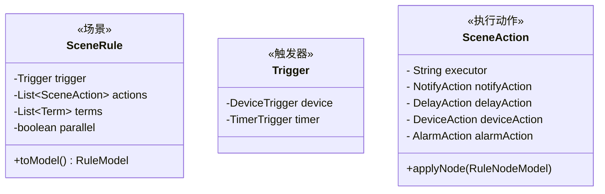

## 触发器Trigger

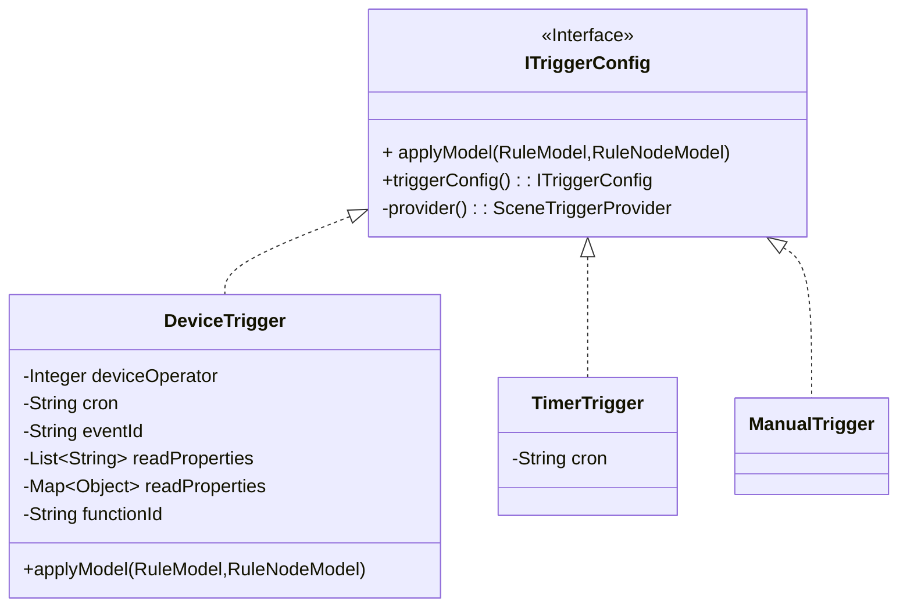

### 执行工厂Action 

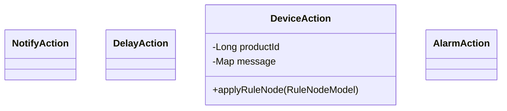

## 场景提供工厂

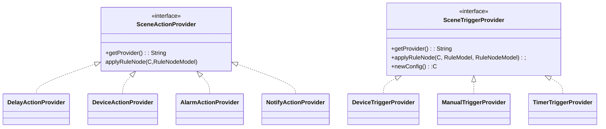

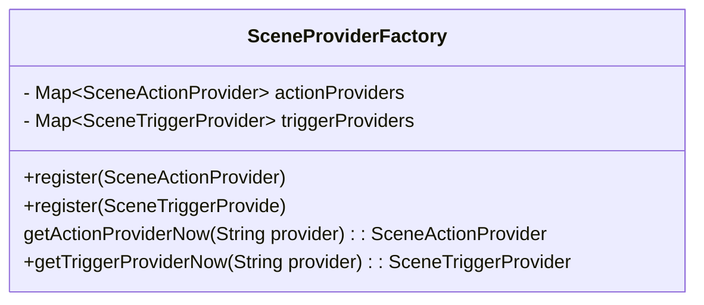

## RuleModel

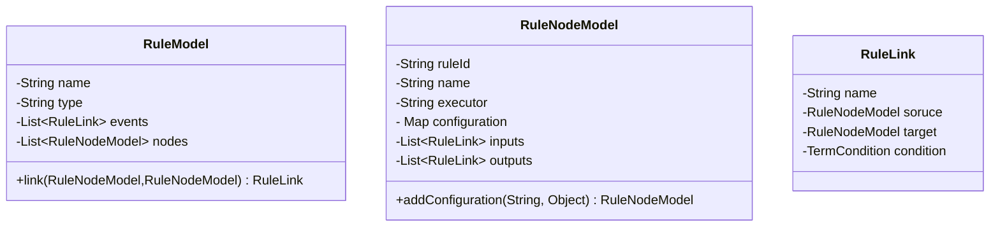

## 任务执行TaskExecutorProvider

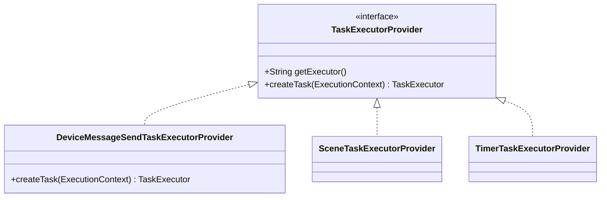

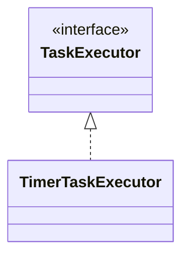

## 调度ScheduleJob

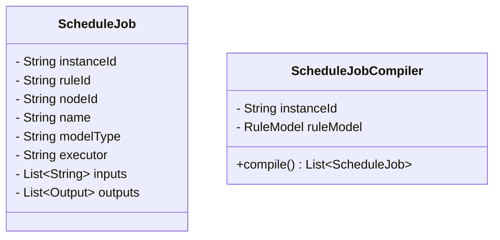

## 调度scheduler

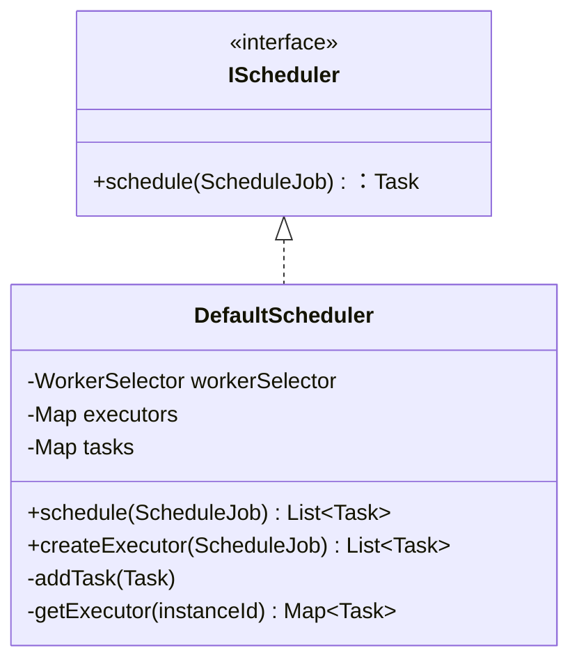

## 工作器Worker

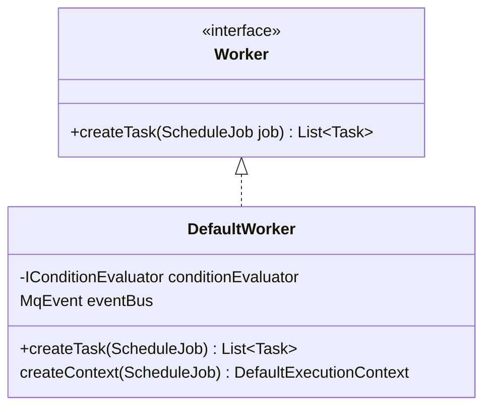

## 具体任务Task 

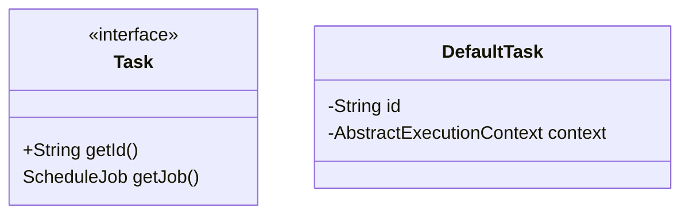

## 执行上下文ExecutionContext

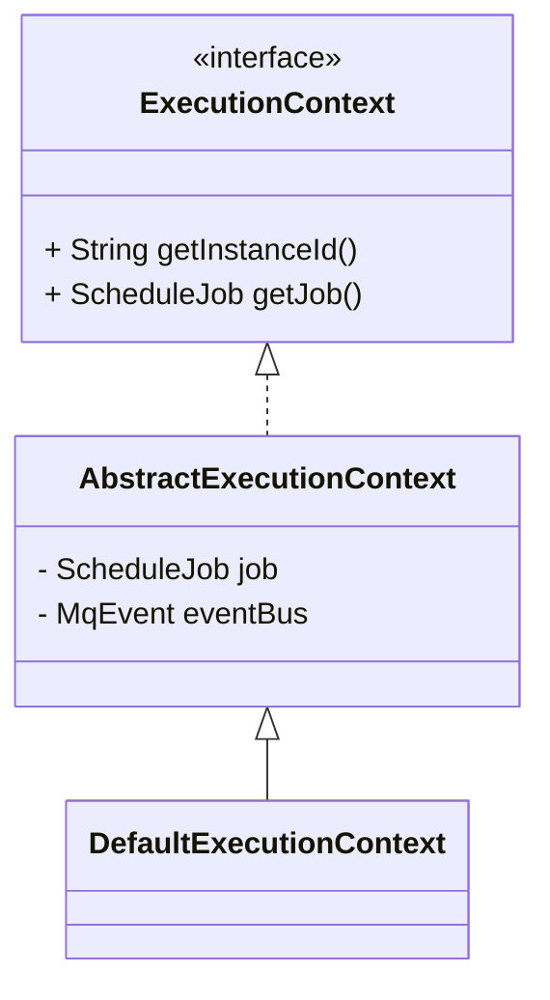

# 未完待续